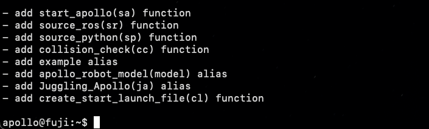
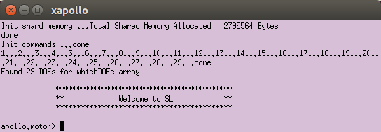
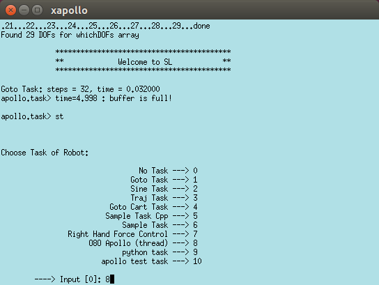

# Juggling Apollo


https://github.com/user-attachments/assets/86405d5a-9c61-4a97-92ee-ae1593eba9c8


This tutorial assumes that the Apollo software is installed successfully.
If that is not done, look into [Apollo : start here](https://atlas.is.localnet/confluence/display/AMDW/Apollo+%3A+start+here) and [MPI System Apollo - Getting Started](https://atlas.is.localnet/confluence/display/AMDW/MPI+System+Apollo+-+Getting+Started) or contact [Vincent Berenz](https://ei.is.mpg.de/person/vberenz).
Once you do that, you should be able to start the simulation and run simple scripts to read the state of Apollo's arms or send position/velocity commands.

We then clone this repo and install its dependencies:
```
git clone https://gitlab.com/learning-and-dynamical-systems/juggling_apollo.git
pip install -r /path/to/requirements.txt
```

## Running a script
The routine for running a script on apollo consists of:
1. Use the KUKA computer to bring Apollo to the home position(ready state) or skip this step if you are using the simulation. Follow [How to start Apollo](https://atlas.is.localnet/confluence/pages/viewpage.action?spaceKey=AMDW&title=How+to+start+Apollo+and+control+it+from+SL) and use [GravComp](https://atlas.is.localnet/confluence/pages/viewpage.action?spaceKey=AMDW&title=GravComp+Mode+illigal+state), [Validate Loaddata](https://atlas.is.localnet/confluence/pages/viewpage.action?spaceKey=AMDW&title=Validate+Loaddata+%24TORQUE_AXIS_EST+limit+exceeded) if you face difficulties with the gravity compensation.

2. Prepare the software backend  
   To simplify this step, we have created a list of aliases that are printed every time the ```.bashrc``` file is sourced:  
     
   
   **a.**  Source the SL/O8o code. (```sp```)  
   **b.**  Create the corresponding launch file  (```cl```, WARN: excludes hands and left arm, has to be changed for other scenarios)  
   **c.**  Roslaunch the created launch file  (```roslaunch start_robot tmp.launch```)


4. Activate the O8o interface  
   **a.** Click enter on the pink(motor) terminal  
     
   **b.** Enter ```st``` followed by ```8``` in the blue(task) terminal  
   
5. Run the script, for example ```ApolloInterface/display_robot_state.py```


### Constrained Inverse Kinematics


https://github.com/user-attachments/assets/03c370d2-9d15-4bbc-8e7f-8f67015e3318


## Trajectory Planning for Juggling

### SiteSwap


https://github.com/user-attachments/assets/648ca09c-fab6-4d25-b643-7efc51ef39c1


## Directory Structure
The essential parts of the code and a short discription of their functionality is presented below:

```
main.py                             # main script (maybe parse arguments here too)
config.py                           # file with all the parameters used across all modules

Requirements.py                     # file with the dependencies

ApolloILC
├── ILC.py                          # defines class that puts ILC components together and defines the update steps
├── DynamicSystem.py                # defines the state space equations of the plant we want to use in ILC
├── LiftedStateSpace.py             # unrolls the state space equations and creates the LSS mappings for the ILC
├── KalmanFilter.py                 # implementation of a simple KF for disturbance estimation
├── OptimLss.py                     # the optimization problem to compute feedforward input for the next iteration
├── settings.py                     # contains physical parameters used in ILC
└── utils.py                        # contains helper functions


ApolloInterface
├── Apollo_It.py                    # defines the interface to the real robot (adapted for ILC)
├── display_robot_state.py          # exampe 1: print out the state information of Apollo
├── position_control.py             # exampe 2: send position control commands
├── velocity_control.py             # exampe 3: send velocity control commands
├── globs.py                        # file containing parameters for start_apollo.py
└── start_apollo.py                 # script to start the simulation in different modes


ApolloKinematics
├── ApolloKinematics.py             # defines class with Apollo's kinematics(fk, ik, seq_ik, seq_fk, etc.)
├── DHFK.py                         # defines class for Denavit-Hartenberg forward kinematics
├── PinFK.py                        # defines class for Pinocchio based forward and inverse kinematics
├── AnalyticalIK.py                 # defines class for the analytical inverse kinematics
├── Sets.py                         # defines helper classes(ContinuousRange and ContinuousSet) required in AnalyticalIK
├── utilities.py                    # contains helper functions
├── settings.py                     # contains Apollo-related information(names of joints, limits etc.)
└── tests                           # contains tests for Jacobian computations and inverse kinematics computations
    ├── check_jac.py
    └── check_ik_real_dh.py

ApolloPlanners
├── MinJerk.py                      # contains functions for minimum jerk interpolation
├── SiteSwapPlanner.py              # defines a juggling pattern parser for arbitrary patterns and hands
├── SiteSwapJointPlanner.py         # transforms plans for usage in Apollo
├── OneBallThrowPlanner.py          # trajectory generation for simple catch-throw
└── utils.py                        # contains helper functions


examples
├── TemplateLearn.py                                            # Template script for learning a triangle like trajectory
├── TemplateSiteSwapJoint.py                                    # Main template for learning juggling patterns
├── Throw_Learn.py                                              # Template to learn a simple catch-throw
├── LoadNLearn.physical                                         # A script that loads an already learned trajectory and continues learning on top.
└── utils.py                                                    # includes tools for plotting and printing the ILC metrics

```
